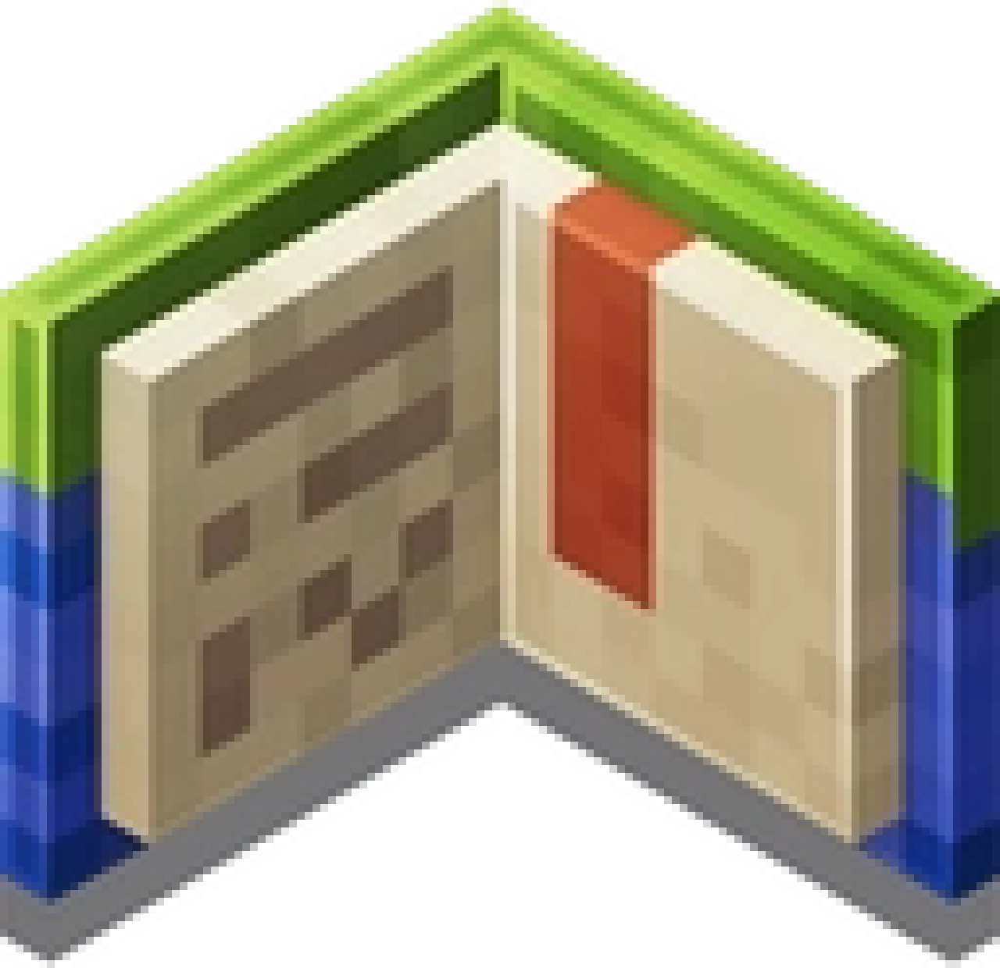

# Hi there
💬 I'm Hoàng but you can call me Hg (my nickname)

🕶️ `He/him` 
⏲️ `18/∞` 
🧠 `UNETI University freshman` 
🎮 `Minecraft Bedrock` 
💙 `Pixel Art` + `Coding` + `EDM`

Languages I know and will improve 

Languages I will learn next 

#  My project
 [MCBE Command Wiki for Vietnamese](https://github.com/HgVN23/HgVN23.github.io)
